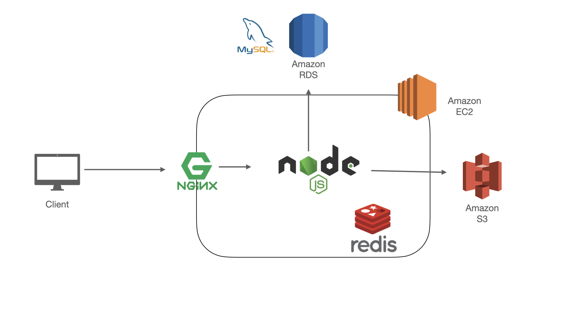

# STYLiSH
**STYLiSH is an e-commerce website for clothes shopping .**
> Website URL : https://inchtw.website/ 

## Table of Contents
* [Main features](#Main-features)
* [Technologies](#Technologies)
* [Architecture](#Architecture)

## Main features
* Achieved e-commerce fundamental functions, such as product list, variants, colors and sizes selections, cart, login, payment features.
* Obtained TapPay SDK(third-party payment API) for credit card payment.
* Implemented shopping cart via LocalStorage.
* Supported Facebook Login feature.
* Monitored sales status with [dashboard](https://inchtw.website/admin/dashboard.html) feature. 

## Technologies
### Backend
* Node.js / Express.js
* RESTful API
* NGINX

### Front-End
* HTML
* CSS
* JavaScript

### Cloud Service (AWS)
* Compute: EC2
* RDS
* S3

### Database
* MySQL
* Redis (cache)

### Networking
* HTTPS
* SSL
* Domain Name System (DNS)

### Tools
* Version Control: Git, GitHub

## Architecture

